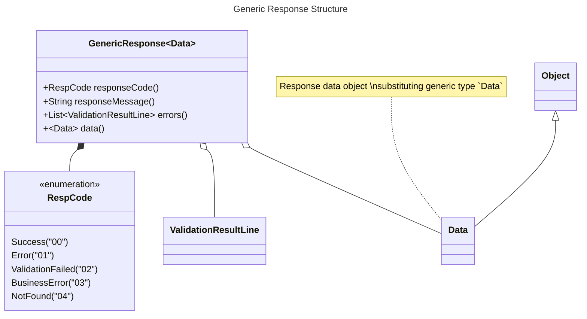

## Request Handling



### Request execution
#### Success


```java


@PostMapping("doSomething")
public GenericResponse<String> doSomething() {
    return GenericResponse.data("success");
}
```


#### Not found


```java


@PostMapping("findBySku")
public GenericResponse<SomeProduct> findBySku(String sku) {
    return GenericResponse.notFound();
}
```

#### Validation Failure


```java

import jdk.jfr.Frequency;
import org.springframework.beans.factory.annotation.Autowired;

import javax.validation.Validator;

@Autowired
Validator validator;

@PostMapping("findBySku")
public GenericResponse<SomeProduct> findBySku(@RequestBody requestData) {
    final var result = validator.validate(Frequency);
    if (!result.isEmpty()) {
        return GenericResponse.validationFail(result);
    }
    // ... real logic below ...
}
```

#### Business Error


```java

import org.springframework.web.bind.annotation.PostMapping;

@PostMapping("doSomething")
public GenericResponse<String> doSomething() {
    try {
        // ... real logic
        if (businessError) { // failed for some business logic
            return GenericResponse.businessError("Some business error happened");
        }
    } catch (Exception e) {
        e.printStackTrace();
        return GenericResponse.error("Some unknown error");
    }
}
```

#### Unexpected Error


```java

import org.springframework.web.bind.annotation.PostMapping;

@PostMapping("doSomething")
public GenericResponse<String> doSomething() {
    try {
        // ... real logic
    } catch (Exception e) {
        e.printStackTrace();
        return GenericResponse.error("Some unknown error");
    }
}
```

### Suggested high level request handling

```java


@PostMapping("doSomething")
public GenericResponse<String> doSomething() {
    try {
        final var result = validator.validate(Frequency);
        if (!result.isEmpty()) {
            return GenericResponse.validationFail(result);
        }
        // ... real logic
        if (businessError) {
            return GenericResponse.businessError("Some business error happened");
        } else {
            return GenericResponse.data(new Object() /* real response here*/);
        }
    } catch (Exception e) {
        e.printStackTrace();
        return GenericResponse.error("Some unknown error");
    }
}
```
